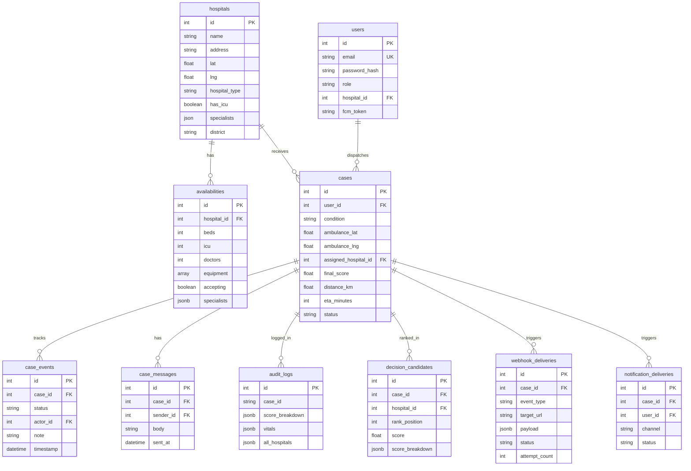

# 🚑 MediRoute — Project Overview for Team

> **Purpose:** This document explains the entire MediRoute project so every team member can confidently present it to the judges. Read through this before the presentation.

> **Live Demo:** [https://technomax-1.onrender.com](https://technomax-1.onrender.com)

---

## 📌 1. What Is MediRoute?

**MediRoute** is a **smart, real-time emergency medical dispatch & routing system** for Uttarakhand.

### The Problem
Traditional ambulance dispatch systems:
- Use **static proximity** — they just send the ambulance to the nearest hospital
- **Ignore** whether the hospital actually has the right equipment (e.g., defibrillator, ICU beds)
- **Ignore** real-time traffic conditions and road types
- **Don't assess** patient stability — a cardiac arrest patient needs different handling than a fracture patient
- Result: Ambulances arrive at hospitals that **can't treat the patient** or are **already full**

### Our Solution
MediRoute uses a **multi-factor intelligent dispatch engine** that considers:

| Factor | How We Use It |
|---|---|
| **Patient Vitals** | SpO2, pulse, BP → stability score to decide "stabilize first" vs "transport directly" |
| **Condition Type** | Cardiac, stroke, trauma, respiratory → maps to required equipment & specialties |
| **Hospital Capabilities** | Equipment list, ICU availability, hospital type (stabilization/advanced/both) |
| **Real-time ETAs** | OpenRouteService API for traffic-aware routing (Haversine fallback when offline) |
| **Bed Availability** | Atomic bed reservation to prevent race conditions between ambulances |
| **ML Scoring** | Pre-trained scikit-learn model with rule-based weighted fallback |

### Who Uses It?
| Role | What They Do |
|---|---|
| **Paramedic** | Inputs patient condition & vitals → receives optimal hospital assignment → follows live map route |
| **Hospital Admin** | Sees incoming ambulances with ETAs → accepts/declines patients → chats with paramedic |
| **System Admin** | Views system-wide stats → monitors active cases → sees district load distribution |

---

## 🛠️ 2. Tech Stack (Know This Cold!)

### Frontend
| Technology | Purpose |
|---|---|
| **React 19 + Vite** | Fast SPA with code-splitting (lazy-loaded pages) |
| **TailwindCSS 3** | Utility-first styling |
| **Leaflet + React-Leaflet** | Interactive maps with live routing polylines |
| **Firebase FCM SDK** | Push notifications for critical alerts |
| **Axios** | HTTP client with JWT interceptors |
| **Web Speech API** | Voice input for hands-free paramedic data entry |

### Backend
| Technology | Purpose |
|---|---|
| **FastAPI (Python 3.12+)** | Async API framework — handles WebSockets natively |
| **SQLAlchemy 2.0** | ORM for PostgreSQL |
| **PostgreSQL 15** | Primary database with JSONB support |
| **Redis 7** | WebSocket state cache, pub/sub, async task queue |
| **RQ (Redis Queue)** | Background jobs for audit logging & webhook delivery |
| **Scikit-learn** | Pre-trained ML model (`hospital_model.pkl`) for hospital scoring |
| **Google Gemini API** | AI-powered medical text parsing & voice transcript analysis |
| **SlowAPI** | Rate limiting |
| **bcrypt + JWT** | Password hashing + token-based auth |

### External APIs
| Service | Purpose |
|---|---|
| **OpenRouteService (ORS)** | Real-time road routing & distance matrices |
| **Google Gemini** | NLP for parsing "patient has chest pain, difficulty breathing" → structured condition + severity |
| **Firebase Cloud Messaging** | Push notifications to hospital dashboards |

### Infrastructure
| Technology | Purpose |
|---|---|
| **Docker Compose** | Multi-container orchestration (backend, frontend, PostgreSQL, Redis) |
| **10 Uvicorn workers** | Production-grade concurrent request handling |
| **Nginx** | Serves frontend static files in production |

---

## 🧠 3. Core Algorithm — The Dispatch Engine

This is the **heart of the project**. Here's how a dispatch decision works end-to-end:

### Step-by-Step Flow

```
┌──────────────────────────────────────────────────────────────────────┐
│                    DISPATCH PIPELINE                                  │
│                                                                      │
│  1. PARAMEDIC INPUT                                                  │
│     condition, vitals (SpO2, pulse, BP), severity, location          │
│                        ↓                                             │
│  2. CONFLICT RESOLUTION                                              │
│     Vitals vs severity conflict? → vitals override severity          │
│     Explicit vs AI-derived condition? → trust hierarchy              │
│                        ↓                                             │
│  3. STABILITY ASSESSMENT                                             │
│     Calculate estimated survival time                                │
│     Compare with ETA to best hospital                                │
│     Decision: "Stabilize First" (nearest) OR "Transport Now" (best)  │
│                        ↓                                             │
│  4. HOSPITAL FILTERING (Hard Constraints)                            │
│     ✗ Missing critical equipment → REJECT                           │
│     ✗ No ICU but patient needs ICU → REJECT                         │
│     ✗ Wrong hospital type → REJECT                                  │
│     ✗ Not accepting patients → REJECT                               │
│                        ↓                                             │
│  5. ML + RULE-BASED SCORING                                         │
│     S_distance (ETA penalty)                                         │
│     S_treatment (capability match)                                   │
│     S_equipment (equipment coverage)                                 │
│     S_load (bed availability)                                        │
│     → Weighted composite score                                       │
│                        ↓                                             │
│  6. BEHAVIOR CORRECTIONS                                             │
│     Cardiac unstable? → prioritize stabilization-capable hospitals   │
│     Stroke? → penalize hospitals without neuro/CT capability         │
│     Respiratory? → enforce ventilator/oxygen equipment match         │
│                        ↓                                             │
│  7. TIE-BREAKING                                                     │
│     Same score bucket (±0.05)?                                       │
│     → Break by: treatment capability > equipment match > hospital ID │
│                        ↓                                             │
│  8. ATOMIC BED RESERVATION                                           │
│     Decrement beds atomically → prevents race conditions             │
│                        ↓                                             │
│  9. RESULT                                                           │
│     → Assigned hospital, score breakdown, ETA, route geometry        │
└──────────────────────────────────────────────────────────────────────┘
```

### Key Algorithms Inside

**Stability Score Formula:**
```
estimated_survival = baseline_minutes × (1 - 0.65 × severity_norm)
                   - 40 × equipment_risk
                   - 25 × vitals_risk
                   
stability_score = estimated_survival / (estimated_survival + ETA)
stabilization_required = estimated_survival < ETA × risk_multiplier
```

**Hospital Scoring (Composite):**
```
Score = (S_distance × W_distance) + (S_treatment × W_treatment) 
      + (S_equipment × W_equipment) + (S_load × W_load)
```
Where weights are condition-dependent and can be adjusted by the ML model.

**Equipment Match:**
```
Equipment Score = (critical_ratio × 0.6) + (important_ratio × 0.3) + (optional_ratio × 0.1)
```

---

## 🗄️ 4. Database Design

### Entity-Relationship Diagram



### Key Design Decisions
- **JSONB columns** for `score_breakdown`, `all_hospitals`, `vitals` — flexible schema for evolving scoring components
- **Case events** table implements an **event-sourcing** pattern for status transitions (`dispatched → accepted → arrived → completed`)
- **Decision candidates** table stores **all** scored hospitals per case (not just the winner) — enables audit replay
- **Atomic bed reservation** via database-level decrement with constraint checks

---

## 🌐 5. API Surface

### REST Endpoints

| Method | Endpoint | Purpose | Auth |
|---|---|---|---|
| `POST` | `/api/auth/register` | Create user account | Public |
| `POST` | `/api/auth/login` | Get JWT token | Public |
| `POST` | `/api/dispatch/` | **Core dispatch decision** | Ambulance |
| `GET` | `/api/cases/` | List paramedic's cases | Ambulance |
| `GET` | `/api/cases/hospital` | List hospital's incoming cases | Hospital |
| `GET` | `/api/cases/admin/stats` | System-wide dashboard data | Admin |
| `PUT` | `/api/cases/{id}/status` | Update case status | Any auth |
| `POST` | `/api/cases/{id}/accept` | Hospital accepts patient | Hospital |
| `POST` | `/api/cases/{id}/decline` | Hospital declines (restores bed) | Hospital |
| `GET` | `/api/cases/{id}/timeline` | Audit trail for a case | Any auth |
| `GET/POST` | `/api/cases/{id}/messages` | Chat messages | Any auth |
| `POST` | `/api/ai/analyze` | Gemini medical text parsing | Auth |
| `POST` | `/api/ai/equipment-recommend` | AI equipment recommendation | Auth |
| `POST` | `/api/voice/parse` | Voice → structured vitals | Auth |
| `GET` | `/api/hospitals/` | List hospitals with availability | Auth |
| `GET` | `/health` | Liveness probe | Public |
| `GET` | `/ready` | Readiness probe (checks DB) | Public |

### WebSocket Channel

**`ws://host/ws/track/{case_id}?token=<jwt>`** — A single, unified bidirectional channel for:
- 📍 **GPS tracking** — ambulance sends lat/lng/speed every 3 seconds
- 📊 **Live ETA updates** — server broadcasts recalculated ETA based on observed speed
- 💬 **Real-time chat** — paramedic ↔ hospital instant messaging
- 📞 **WebRTC signaling** — voice call setup (offers, answers, ICE candidates)
- 🔔 **Status transitions** — automated broadcasts when case status changes

---

## 💻 6. Frontend Pages

### Login Page (`/login`)
- Role-based login (Paramedic / Hospital / Admin)
- JWT token stored in localStorage
- Animated dispatch-themed UI


### Dispatch Page (`/dispatch`) — Paramedic View
- **Step 1:** Select condition type (cardiac, stroke, trauma, etc.)
- **Step 2:** Input vitals via form OR voice dictation (Web Speech API → Gemini parsing)
- **Step 3:** AI recommends equipment based on condition
- **Step 4:** GPS auto-detects ambulance location
- **Step 5:** Submit → dispatch engine runs → result page

### Result Page (`/result`) — Post-Dispatch
- Shows assigned hospital with score breakdown
- Interactive Leaflet map with route polyline
- Live GPS tracking with ETA countdown
- Chat panel for paramedic ↔ hospital communication
- Case timeline showing event history

### Hospital Dashboard (`/hospital/dashboard`)
- Kanban-style board of incoming ambulances
- Color-coded by urgency (ETA < 5 min = red, 5-15 min = yellow)
- Accept/Decline buttons with bed restoration on decline
- Live chat with paramedic

### Hospital Tracking (`/hospital/track/:case_id`)
- Full-screen map tracking specific ambulance
- Live ETA updates
- Detailed patient info and vitals

### Admin Dashboard (`/admin/dashboard`)
- System-wide statistics (total hospitals, beds, ICU, cases)
- District load distribution
- Recent case activity
- Hospital acceptance rates

---

## 🔒 7. Security Features

| Feature | Implementation |
|---|---|
| **Authentication** | JWT tokens with bcrypt password hashing |
| **RBAC** | 3 roles: `ambulance`, `hospital`, `admin` — route-level protection |
| **Rate Limiting** | SlowAPI middleware on all API endpoints |
| **Input Validation** | Pydantic schemas with field validators |
| **SQL Injection** | Prevented by SQLAlchemy ORM (parameterized queries) |
| **Security Headers** | Custom middleware adds X-Frame-Options, X-Content-Type-Options, etc. |
| **WebSocket Auth** | JWT token validated on WebSocket connection establishment |
| **PII Protection** | Patient identifiable information stripped from audit logs |
| **Medical Keyword Guard** | AI endpoints verify input contains medical context before processing |

---

## 🧪 8. Testing Strategy

### Test Suite: 33 Test Files

| Category | Files | What They Test |
|---|---|---|
| **Dispatch Logic** | `test_dispatch.py`, `test_dispatch_additions.py` | End-to-end dispatch pipeline |
| **ML Scorer** | `test_ml_scorer.py` | Hybrid ML + rule-based scoring |
| **Stability Engine** | `test_stability_engine.py` | Patient stability assessment |
| **Auth & Security** | `test_auth.py`, `test_security_holes.py`, `test_rate_limits.py` | JWT, RBAC, rate limiting |
| **Cases & Workflow** | `test_cases.py`, `test_hospital_workflow.py`, `test_bed_restoration.py` | Case lifecycle, bed management |
| **Services** | `test_routing_service.py`, `test_eta_service.py`, `test_notification_service.py` | External integrations |
| **Validation** | `test_validation.py`, `quick_validation_test.py`, `advanced_validation.py` | 40-case regression harness |
| **Adversarial** | `adversarial_dataset.py`, `chaos_dataset.py` | Edge cases, malformed inputs |
| **Trust System** | `trust_layer.py`, `trust_pipeline.py`, `demo_trust_system.py` | ML trust and drift detection |
| **Chat & Voice** | `test_case_messages.py`, `test_voice_parse.py` | Messaging, voice parsing |

### Validation Harness
- **40 pre-defined test cases** covering every condition type, severity level, and edge case
- Must pass 100% before any code merge
- Run via: `make validate`

---

## 🐳 9. Deployment Architecture

```
┌──────────────────────────────────────────────────────────┐
│                  Docker Compose Stack                      │
│                                                          │
│  ┌──────────┐   ┌──────────────┐   ┌──────────────┐     │
│  │ Frontend │   │   Backend    │   │   Redis 7    │     │
│  │  (Nginx) │──▶│  (FastAPI)   │──▶│  (Cache/     │     │
│  │  :3000   │   │  10 workers  │   │   Pub/Sub)   │     │
│  │          │   │  :8000       │   │  :6379       │     │
│  └──────────┘   └──────┬───────┘   └──────────────┘     │
│                         │                                │
│                  ┌──────▼───────┐                        │
│                  │ PostgreSQL 15│                        │
│                  │  :5432       │                        │
│                  │ max_conn=700 │                        │
│                  └──────────────┘                        │
└──────────────────────────────────────────────────────────┘
```

**Production (Render):**
- Backend + Frontend deployed on Render
- Managed PostgreSQL database
- Redis for caching and real-time features

---

## 🎯 10. Key Talking Points for Judges

### "What makes this different from a regular ambulance GPS?"
> "Regular GPS just shows the shortest route. MediRoute evaluates patient stability, hospital capabilities, equipment match, bed availability, AND traffic-aware ETAs simultaneously. It's a multi-factor decision engine, not just navigation."

### "How do you handle edge cases?"
> "We have a 40-case validation harness covering every scenario: no available hospitals, GPS drift, equal-score ties, stale bed data, missing vitals, equipment name typos, and more. We also have an adversarial test suite that deliberately tries to break the system."

### "What about when the internet goes down?"
> "Every external API has a fallback. ORS routing fails? We use Haversine straight-line math. Gemini AI fails? We have a full regex-based parser. Firebase down? Notifications queue for retry. The system degrades gracefully."

### "How does the ML model work?"
> "We trained a scikit-learn model on historical dispatch data. But we don't blindly trust it — it's a hybrid system. The ML model provides weights, and a rule-based engine applies hard constraints (e.g., cardiac patient MUST have a defibrillator). The ML enhances scoring, but safety rules can never be overridden."

### "How do you prevent two ambulances from being sent to the same last bed?"
> "Atomic bed reservation. When a dispatch is made, we decrement the bed count atomically in a database transaction. If a hospital declines, the bed is instantly restored. This prevents race conditions."

### "What about real-time tracking?"
> "WebSocket-based. The ambulance sends GPS pings every 3 seconds. The server recalculates ETA using observed speed vs route geometry and broadcasts updates to the hospital dashboard. Everything happens in under 100ms."

### "What's the tech debt?"
> "Two things: (1) The WebRTC voice call client integration needs further testing, and (2) the production Firebase configuration needs real credentials. Everything else is battle-tested with 33 test files."

---

## 📹 11. Demo Video Links

| # | Video | Link |
|---|---|---|
| 1 | Web Development Part 1 | [https://youtu.be/J3RhtarqRgM](https://youtu.be/J3RhtarqRgM) |
| 2 | Web Development Part 2 | [https://youtu.be/DkorTlIHQ6E](https://youtu.be/DkorTlIHQ6E) |
| 3 | Web Development Part 3 | [https://youtu.be/vQHat2PxV5E](https://youtu.be/vQHat2PxV5E) |
| 4 | Web Development Part 4 | [https://youtu.be/llQM1kRlNVI](https://youtu.be/llQM1kRlNVI) |
| 5 | Web Development Part 5 | [https://youtu.be/Es2-3PQitOw](https://youtu.be/Es2-3PQitOw) |

---

## 📁 12. Quick File Reference

### Backend — Where to find things
| What | File Path |
|---|---|
| Main app entry | `backend/app/main.py` |
| Dispatch engine (2300+ lines) | `backend/app/engine/dispatch_engine.py` |
| ML scorer (58K) | `backend/app/engine/ml_scorer.py` |
| Stability engine | `backend/app/engine/stability_engine.py` |
| AI text parsing | `backend/app/api/endpoints/ai.py` |
| Voice parsing | `backend/app/api/endpoints/voice.py` |
| WebSocket tracking | `backend/app/api/endpoints/tracking.py` |
| Database models | `backend/app/db/models.py` |
| Routing service (ORS) | `backend/app/services/routing_service.py` |
| ETA service | `backend/app/services/eta_service.py` |
| Notification service | `backend/app/services/notification_service.py` |
| Dispatch service | `backend/app/services/dispatch_service.py` |
| ML model file | `backend/ml_training/hospital_model.pkl` |
| 40-case validation | `backend/tests/test_validation.py` |
| Docker config | `docker-compose.yml` |

### Frontend — Where to find things
| What | File Path |
|---|---|
| App routing | `frontend/src/App.jsx` |
| Login page | `frontend/src/pages/Login.jsx` |
| Dispatch page | `frontend/src/pages/Dispatch.jsx` (29K) |
| Result page | `frontend/src/pages/Result.jsx` (37K) |
| Hospital dashboard | `frontend/src/pages/HospitalDashboard.jsx` (26K) |
| Admin dashboard | `frontend/src/pages/AdminDashboard.jsx` |
| Map widget | `frontend/src/components/MapWidget.jsx` (24K) |
| Voice input | `frontend/src/components/VoiceInput.jsx` (17K) |
| Case chat | `frontend/src/components/CaseChat.jsx` |
| Call panel (WebRTC) | `frontend/src/components/CallPanel.jsx` (18K) |
| Case timeline | `frontend/src/components/CaseTimeline.jsx` |
| Firebase config | `frontend/src/firebase.js` |

---

## ⚡ 13. Quick Start (For Team Members)

### Running Locally
```bash
# 1. Clone the repo
git clone <repo-url>

# 2. Start everything with Docker
docker-compose up --build

# 3. Access:
#    Frontend:  http://localhost:3000
#    Backend:   http://localhost:8000
#    API Docs:  http://localhost:8000/docs
```

### Default Test Accounts (after seeding)
Run `python seed_users.py` in backend to create test accounts. The seeded roles include:
- **Ambulance/Paramedic** accounts
- **Hospital** accounts (linked to specific hospitals)
- **Admin** accounts

---

> [!IMPORTANT]
> **Before the presentation:** Make sure you can explain the dispatch flow diagram (Section 3) and answer the judge questions (Section 10). These are the two things judges will care about most.

> [!TIP]
> The live demo is at [https://technomax-1.onrender.com](https://technomax-1.onrender.com). Render's free tier may cold-start (takes ~30 seconds). The app has a built-in `BackendWakeUp` component that shows a loading banner while the backend spins up.
